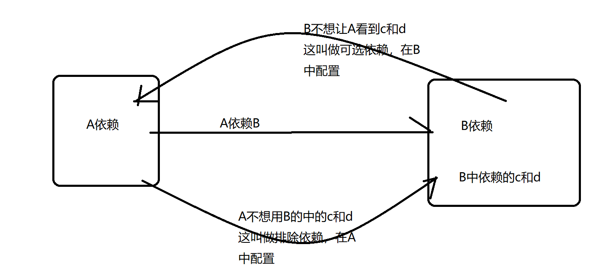
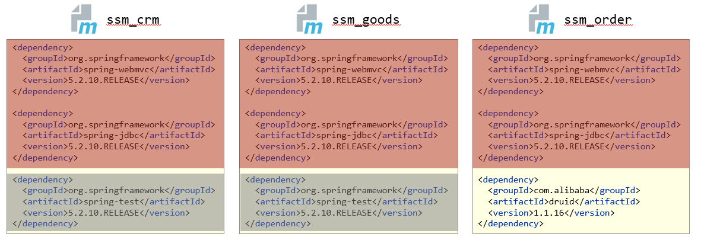
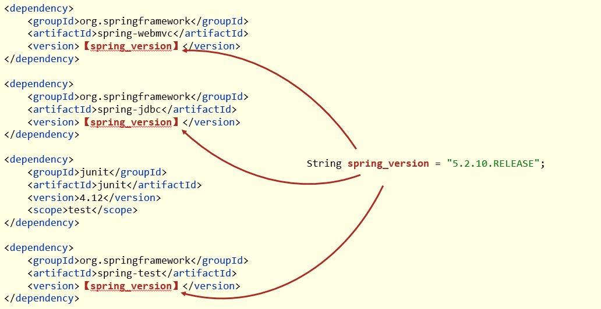
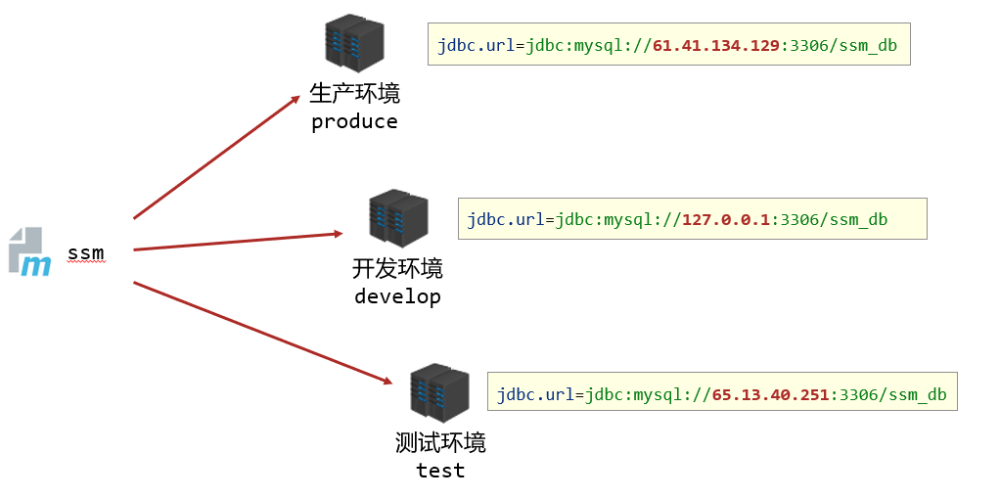
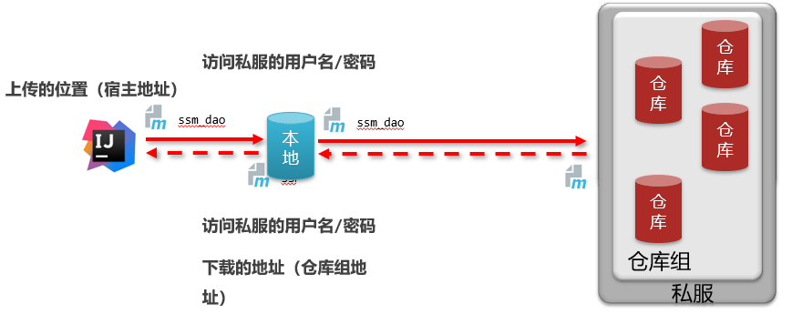

# 一.分模块开发与设计

目的：项目的扩展性变强了，方便其他项目引用相同的功能。


# 二.依赖管理

## 1.介绍

依赖管理指当前项目运行所需的jar，一个项目可以设置多个依赖

```xml
<!--设置当前项目所依赖的所有jar-->
<dependencies>
    <!--设置具体的依赖-->
    <dependency>
        <!--依赖所属群组id-->
        <groupId>org.springframework</groupId>
        <!--依赖所属项目id-->
        <artifactId>spring-webmvc</artifactId>
        <!--依赖版本号-->
        <version>5.2.10.RELEASE</version>
    </dependency>
</dependencies>
```

## 2.依赖传递

依赖具有传递性

- 直接依赖：在当前项目中通过依赖配置建立的依赖关系
- 间接依赖：被资源的资源如果依赖其他资源，当前项目间接依赖其他资源
- 特殊优先：当同级配置了相同资源的不同版本，后配置的覆盖先配置的


## 3.可选依赖

A依赖B，B依赖C，如果A不想将C依赖进来，是否可以做到？

- 可选依赖指对外隐藏当前所依赖的资源——不透明

```xml
<dependency>
    <groupId>com.itheima</groupId>
    <artifactId>maven_pojo</artifactId>
    <version>1.0-SNAPSHOT</version>
    <!--可选依赖是隐藏当前工程所依赖的资源，隐藏后对应资源将不具有依赖传递性-->
    <optional>false</optional>
</dependency>
```

## 4.排除依赖

A依赖B，B依赖C，如果A不想将C依赖进来，是否可以做到？

- 排除依赖指主动断开依赖的资源，被排除的资源无需指定版本——不需要
- 排除依赖资源仅指定GA即可，无需指定V

```xml
<dependency>
    <groupId>com.itheima</groupId>
    <artifactId>maven_dao</artifactId>
    <version>1.0-SNAPSHOT</version>
    <!--排除依赖是隐藏当前资源对应的依赖关系-->
    <exclusions>
        <exclusion>
            <groupId>log4j</groupId>
            <artifactId>log4j</artifactId>
        </exclusion>
        <exclusion>
            <groupId>org.mybatis</groupId>
            <artifactId>mybatis</artifactId>
        </exclusion>
    </exclusions>
</dependency>
```

## 5.可选依赖和排除依赖的区别



# 三.聚合与继承

## 1.聚合工程

- 聚合：将多个模块组织成一个整体，同时进行项目构建的过程称为聚合
- 聚合工程：通常是一个不具有业务功能的”空“工程（有且仅有一个pom文件）

- 作用：使用聚合工程可以将多个工程编组，通过对聚合工程进行构建，实现对所包含的模块进行同步构建
  - 当工程中某个模块发生更新（变更）时，必须保障工程中与已更新模块关联的模块同步更新，此时可以使用聚合工程来解决批量模块同步构建的问题


## 2.聚合工程开发

1. 创建Maven模块，设置打包类型为pom

   ```xml
   <packaging>pom</packaging>
   ```

   注意事项：每个maven工程都有对应的打包方式，默认为jar，web工程打包方式为war

2. 设置当前聚合工程所包含的子模块名称

   ```xml
       <modules>
           <module>SSM</module>
           <module>domain</module>
           <module>dao</module>
       </modules>
   ```

   注意事项：

   - 聚合工程中所包含的模块在进行构建时会根据模块间的依赖关系设置构建顺序，与聚合工程中模块的配置书写位置无关。

   - 参与聚合的工程无法向上感知是否参与聚合，只能向下配置哪些模块参与本工程的聚合。

## 3.继承关系

概念：子工程可以继承父工程中的配置信息，常见于依赖关系的继承

作用：简化配置、减少版本冲突



继承关系开发：

1. 创建Maven模块，设置打包类型为pom

   ```xml
   <packaging>pom</packaging>
   ```

   注意事项：建议父工程打包方式设置为pom

2. 在父工程的pom文件中配置依赖关系（子工程将沿用父工程中的依赖关系）

   ```xml
   <dependencies>
       <dependency>
           <groupId>org.springframework</groupId>
           <artifactId>spring-webmvc</artifactId>
           <version>5.2.10.RELEASE</version>
       </dependency>
       ……
   </dependencies>
   ```

3. 配置子工程中可选的依赖关系

   ```xml
   <dependencyManagement>
       <dependencies>
           <dependency>
               <groupId>com.alibaba</groupId>
               <artifactId>druid</artifactId>
               <version>1.1.16</version>
           </dependency>
           ……
       </dependencies>
   </dependencyManagement>
   ```

4. 在子工程中配置当前工程所继承的父工程

   ```xml
   <!--定义该工程的父工程-->
   <parent>
       <groupId>com.itheima</groupId>
       <artifactId>maven_parent</artifactId>
       <version>1.0-SNAPSHOT</version>
       <!--填写父工程的pom文件，根据实际情况填写-->
       <relativePath>../maven_parent/pom.xml</relativePath>
   </parent>
   ```

5. 在子工程中配置使用父工程中可选依赖的坐标

   ```xml
   <dependencies>
       <dependency>
           <groupId>com.alibaba</groupId>
           <artifactId>druid</artifactId>
       </dependency>
   </dependencies>
   ```

   注意事项：

   - 子工程中使用父工程中的可选依赖时，仅需要提供群组id和项目id，无需提供版本，版本由父工程统一提供，避免版本冲突
   - 子工程中还可以定义父工程中没有定义的依赖关系

# 四.依赖属性管理

## 1.属性配置与使用

引用属性：



自定义属性：

```xml
<!--定义自定义属性-->
<properties>
    <spring.version>5.2.10.RELEASE</spring.version>
    <junit.version>4.12</junit.version>
</properties>
```

## 2.资源文件引用属性

1. 定义属性

   ```xml
   <!--定义自定义属性-->
   <properties>
       <spring.version>5.2.10.RELEASE</spring.version>
       <junit.version>4.12</junit.version>
       <jdbc.url>jdbc:mysql://127.0.0.1:3306/ssm_db</jdbc.url>
   </properties>
   ```

2. 配置文件中引用属性

   ```properties
   jdbc.driver=com.mysql.jdbc.Driver
   jdbc.url=${jdbc.url}
   jdbc.username=root
   jdbc.password=root
   ```

3. 开启资源文件目录加载属性的过滤器

   ```xml
   <build>
       <resources>
           <resource>
               <directory>${project.basedir}/src/main/resources</directory>
               <filtering>true</filtering>
           </resource>
       </resources>
   </build>
   ```

4. 配置maven打war包时，忽略web.xml检查

   ```xml
   <plugin>
       <groupId>org.apache.maven.plugins</groupId>
       <artifactId>maven-war-plugin</artifactId>
       <version>3.2.3</version>
       <configuration>
           <failOnMissingWebXml>false</failOnMissingWebXml>
       </configuration>
   </plugin>
   ```

## 3.其他属性


# 五.版本管理

**工程版本**：

- SNAPSHOT（快照版本）
  - 项目开发过程中临时输出的版本，称为快照版本
  - 快照版本会随着开发的进展不断更新
- RELEASE（发布版本）
  - 项目开发到进入阶段里程碑后，向团队外部发布较为稳定的版本，这种版本所对应的构件文件是稳定的
  - 即便进行功能的后续开发，也不会改变当前发布版本内容，这种版本称为发布版本


# 六.多环境配置与应用

## 1.多环境配置作用

maven提供配置多种环境的设定，帮助开发者使用过程中快速切换环境



## 2.多环境配置步骤

1. 定义多环境

   ```xml
   <!--定义多环境-->
   <profiles>
       <!--定义具体的环境：生产环境-->
       <profile>
           <!--定义环境对应的唯一名称-->
           <id>env_dep</id>
           <!--定义环境中专用的属性值-->
           <properties>
               <jdbc.url>jdbc:mysql://127.0.0.1:3306/ssm_db</jdbc.url>
           </properties>
           <!--设置默认启动-->
           <activation>
               <activeByDefault>true</activeByDefault>
           </activation>
       </profile>
       <!--定义具体的环境：开发环境-->
       <profile>
           <id>env_pro</id>
           ……
       </profile>
   </profiles>
   ```

2. 使用多环境（构建过程）

   ```shell
   #命令格式：
   $ mvn 指令 –P 环境定义id
   
   #范例
   $ mvn install –P pro_env
   ```

# 七.跳过测试阶段

- 命令跳过测试

```shell
$ mvn install –D skipTests
```

- 细粒度控制跳过测试

```xml
<plugin>
    <artifactId>maven-surefire-plugin</artifactId>
    <version>2.22.1</version>
    <configuration>
        <skipTests>true</skipTests>
        <!--设置跳过测试-->
        <includes>
            <!--包含指定的测试用例-->
            <include>**/User*Test.java</include>
        </includes>
        <excludes>
            <!--排除指定的测试用例-->
            <exclude>**/User*TestCase.java</exclude>
        </excludes>
    </configuration>
</plugin>
```

# 八.私服

私服是一台独立的服务器，用于解决团队内部的资源共享与资源同步问题

## 1.Nexus

- Sonatype公司的一款maven私服产品
- 下载地址：https://help.sonatype.com/repomanager3/download 


## 2.Nexus安装与启动

- 启动服务器（命令行启动）
  - nexus.exe /run nexus

- 访问服务器（默认端口：8081）
  - http://localhost:8081

- 修改基础配置信息
  - 安装路径下etc目录中nexus-default.properties文件保存有nexus基础配置信息，例如默认访问端口。
- 修改服务器运行配置信息
  - 安装路径下bin目录中nexus.vmoptions文件保存有nexus服务器启动对应的配置信息，例如默认占用内存空间。

## 3.私服资源操作流程分析


## 4.私服仓库分类


## 5.资源上传与下载

- 身份认证



- 从私服中下载依赖

  1. 第一步】在maven的settings.xml中\<mirrors>标签中配置，此时就需要注释掉aliyun的配置。

     ```xml
     <mirror>
         <id>nexus-heima</id>
         <mirrorOf>*</mirrorOf>
         <url>http://localhost:8081/repository/maven-public/</url>
     </mirror>
     ```

  2. 【第二步】在nexus中设置`setting-Security-Anonymous-Allow anonymous users to access the server`允许匿名下载，如果不允许将不会从私服中下载依赖

  3. 如果私服中没有对应的jar，会去中央仓库下载，速度很慢。可以配置让私服去阿里云中下载依赖。`setting-Repository-maven central- Remote storage`

- 上传依赖到私服中

  1. 【第一步】配置本地仓库访问私服的权限（在maven的settings.xml的servers标签中配置）

     ```xml
     <server>
       <!--id任意，多个server的id不重复就行，后面会用到-->
       <id>heima-nexus</id>
       <username>admin</username>
       <password>123456</password><!--填写自己nexus设定的登录秘密-->
     </server>
     ```

  2. 【第二步】配置当前项目访问私服上传资源的保存位置（项目的pom.xml文件中配置）

     ```xml
     <distributionManagement>
         <repository>
           	<!--和maven/settings.xml中server中的id一致，表示使用该id对应的用户名和密码-->
             <id>heima-nexus</id>
           	<!--如果jar的版本是release版本，那么就上传到这个仓库，根据自己情况修改-->
             <url>http://localhost:8081/repository/heima-releases/</url>
         </repository>
         <snapshotRepository>
           	<!--和maven/settings.xml中server中的id一致，表示使用该id对应的用户名和密码-->
             <id>heima-nexus</id>
           	<!--如果jar的版本是snapshot版本，那么就上传到这个仓库，根据自己情况修改-->
             <url>http://localhost:8081/repository/heima-snapshots/</url>
         </snapshotRepository>
     </distributionManagement>
     ```

     注意：要和maven的settings.xml中server中定义的`\<id>heima-nexus\</id>`对应

  3. 【第三步】发布资源到私服命令

     ```shell
     $ mvn deploy
     ```

     

